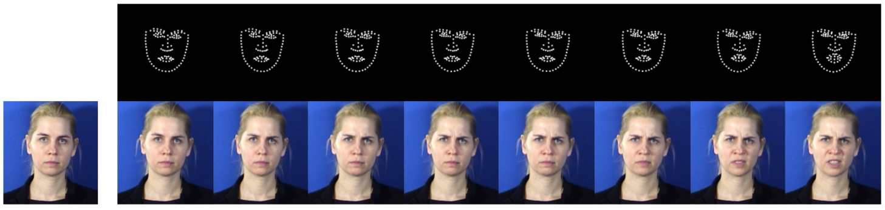
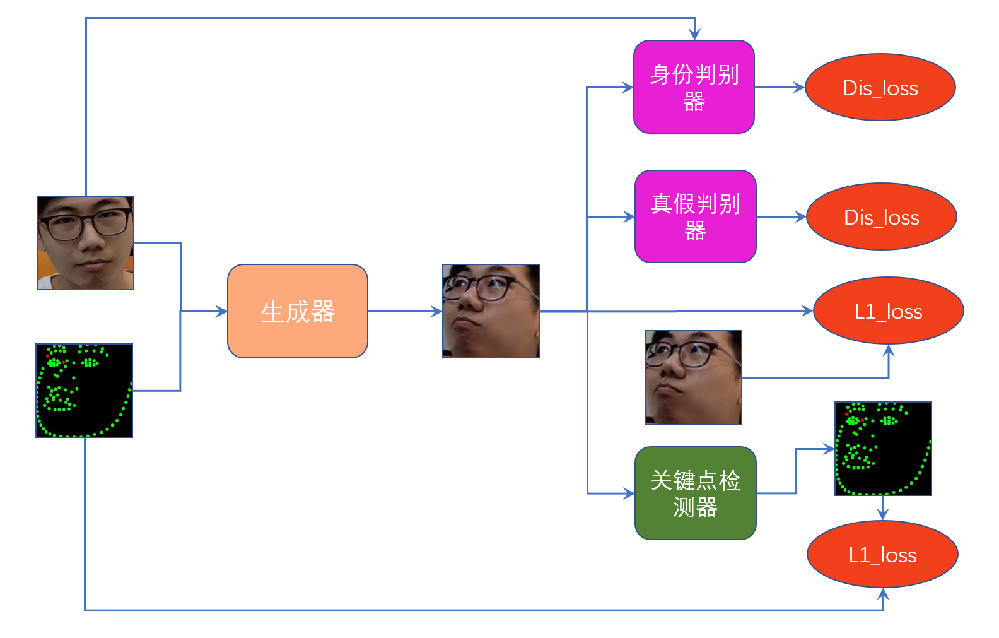

# Facial_Expression_GAN
由一张人脸图和一系列人脸关键点生成一段视频

任务简介

这个项目是我参加第一届BIGO短视频内容智能制作技术挑战赛的解决方案。生成的结果获得了人脸生成任务的二等奖。

数据集

这一比赛给出的训练集是若干个视频，以及每个视频中每一帧的人脸bbox和人脸关键点坐标（104个关键点）。要求给出一个模型能够以人脸图片和人脸关键点序列作为输入，并生成外观与参考图片一致且人脸表情与输入关键点序列一致的视频序列。任务示例如下

数据集： https://share.weiyun.com/54e3ZQ0 （数据归BIGO公司所有，如有研究之外的用途请自行联系BIGO）

测试数据将根据生成难度分为简单，适中，困难三个等级。人脸表情生成的难易度则与人脸的角度变化幅度和参考图片中人脸的挂饰的丰富度成正比。即在一段测试序列中，人脸角度变化幅度越大，人脸挂饰越多，测试难度越大。

上面的示例只是最简单的情况，而在实际的样本中

- 人脸可能只占据了画面的很小一部分
- 可能是抬头低头抑或是侧脸
- 存在人脸被部分遮挡甚至不在画面内的情况

结果评价

对结果的评价指标有以下四个：

1. 图像质量评价指标PSNR
2. 图像质量评价指标SSIM
3. 人脸身份分类精度
4. 人脸关键点检测精度

解决方案

预处理

因为每帧图像中不止有人脸，还有身体部分和复杂的背景。为了更好的生成人脸，我首先利用人脸的bbox信息将人脸裁剪出来，训练集和测试集都是如此。

dataset/face_crop.py中的crop_face函数就是用来将人脸从原视频中裁剪下来的，而其中的draw_bbox_keypoints函数则是将人脸关键点的坐标绘制成背景为黑色的关键点图

条件GAN生成人脸

GAN的部分是这个项目的主体部分，首先用一张图说明一下模型架构：

模型方面我做了很多尝试，除了根文件夹中的main文件还包括discarded文件夹中的，最终我采用的是

